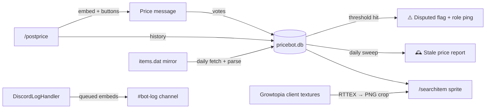

<div align="center">

# 💎 Prices Uncovered - Live Price Bot

**A Discord bot for tracking Growtopia item prices with community-driven accuracy voting, full price history, automatic dispute detection, and a built-in Growtopia item database with sprite rendering.**


</div>

---

## ✨ What it does

Price editors post rich, styled price embeds for in-game items. The community votes on each price with persistent **✅ Accurate / ❌ Inaccurate** buttons. Every post, edit, and vote is recorded in SQLite, giving you searchable price history, dispute alerts, and stale-price reports out of the box.

<table>
<tr>
<td>

**📍 Live price embeds**
Wiki-linked titles, demand-colored accents, price trends, proof screenshots, and Discord-native timestamps that render in each viewer's local timezone.

</td>
<td>

**🗳️ One vote per user**
Vote state is keyed by message ID in SQLite, so votes survive restarts and nobody can double-vote. Button labels update with live counts.

</td>
</tr>
<tr>
<td>

**⚠️ Automatic dispute detection**
When a price collects enough inaccurate votes (configurable threshold + ratio), it's flagged **Disputed - needs a re-check** on the embed and the price editor role gets pinged.

</td>
<td>

**🕰️ Stale price sweeper**
A daily background task reports items whose latest price is older than a configurable number of days, so nothing rots quietly.

</td>
</tr>
<tr>
<td>

**🧱 Growtopia item database**
The bot auto-downloads the latest `items.dat` (16,000+ items), parses it with a built-in decoder (format v26 supported), and stores every item - name, description, rarity, type, texture coords - in SQLite. Refreshes itself daily.

</td>
<td>

**🖼️ Item sprite rendering**
Item sprites are cropped straight out of the game's RTTEX texture sheets (harvested from a local Growtopia install and/or the game CDN), converted to PNG, upscaled, cached, and attached to embeds.

</td>
</tr>
</table>

---

## 🧭 Commands

### Everyone

| Command | Description |
|---|---|
| `/checkprice <item>` | Look up the latest recorded price for an item (with autocomplete + fuzzy matching) |
| `/pricehistory <item>` | Timeline of an item's price movements - posts 📦 and edits 📝 |
| `/searchitem <item>` | Search the Growtopia item database - name, description, rarity, type, break hits, and the item's sprite (autocomplete across 16k+ items) |
| `/iteminfo <id>` | Same lookup by exact item ID |
| `/itemsprite <item> [scale]` | Download an item's sprite as a PNG, upscaled 1-8x |
| `/itemdb` | Item database status - items.dat version, item count, texture/sprite cache stats |

### Price editors (role-gated)

| Command | Description |
|---|---|
| `/postprice` | Post a full price dashboard embed - item, price, demand, trend, variant, emoji, thumbnail, banner, proof pic, notes, target channel |
| `/editprice <message>` | Edit any field of an already-posted price via message link or ID; marks it *(edited)* and records the change in history |
| `/deleteprice <message>` | Delete a price post and wipe its vote data |
| `/votes [message]` | Vote breakdown for one price - or, with no argument, a leaderboard of the most disputed prices |
| `/updateitems [force]` | Force-refresh the item database (items.dat + client textures) |
| `/version` | Show the running bot version |

### Admin / owner

| Command | Description |
|---|---|
| `/forceupdate` | Force-sync slash commands (requires *Manage Server*) |
| `/restart` | Restart the bot process (bot owner / team members only) |

---

## 🏗️ Architecture highlights



- **SQLite storage** : four tables (`votes`, `prices`, `items`, `item_meta`) with a context-managed connection (commit-on-success, guaranteed close). A one-time migration imports the legacy `votes.json` on first boot.
- **Built-in items.dat decoder** ([gtitems.py](gtitems.py)) : parses the game's binary item database (XOR-encrypted names, versioned field layout up to format v26) entirely in-repo, so a game update can't silently break lookups - unknown formats fail loudly.
- **Sprite pipeline** : texture sheets are harvested from a local Growtopia install (base sheets + live-update deltas) or a configurable CDN, decoded from RTTEX via `growtopia-api`, cropped to the item's 32x32 tile, upscaled with nearest-neighbor, and cached as PNGs on disk. Missing textures degrade gracefully to sprite-less embeds.
- **Persistent views** : vote buttons use fixed `custom_id`s and are re-registered on startup, so they keep working across restarts.
- **Discord-native logging** : a custom `logging.Handler` ships INFO+ records to a log channel as color-coded embeds via a non-blocking queue, with loop-protection against discord.py's own chatter.
- **Interaction audit trail** : every slash command and button press is logged with the user, options, and channel.
- **3-second rule respected** : button clicks are acknowledged immediately; DB writes, message edits, and log sends happen after the ack so the interaction token never expires mid-vote.

---

## 🚀 Setup

### 1. Requirements

- Python **3.10+** (uses `X | None` union syntax)
- A Discord bot application with the **Message Content** intent enabled
- *(optional, for item sprites)* a local Growtopia client install - its texture sheets are harvested automatically

### 2. Install

```bash
git clone <this-repo>
cd price-bot
pip install -r requirements.txt
```

### 3. Configure

Set your environment variables (only `DISCORD_TOKEN` is strictly required):

| Variable | Default | Purpose |
|---|---|---|
| `DISCORD_TOKEN` | - *(required)* | Bot token |
| `PRICE_EDITOR_ROLE_ID` | built-in ID | Role allowed to post/edit/delete prices |
| `LOG_CHANNEL_ID` | built-in ID | Channel for vote logs |
| `BOT_LOG_CHANNEL_ID` | built-in ID | Channel for interaction audit + info/warning/error embeds |
| `GUILD_ICON_URL` | built-in URL | Author icon on price embeds |
| `INVITE_URL` | built-in URL | Server invite shown in embed footers |
| `DISPUTED_MIN_VOTES` | `5` | Minimum inaccurate votes before a price can be flagged |
| `DISPUTED_RATIO` | `0.6` | Fraction of votes that must be inaccurate to flag |
| `STALE_PRICE_DAYS` | `14` | Age threshold for the daily stale-price report |
| `ITEMS_MIRROR_BASE` | StileDevs/itemsdat-archive | Mirror that tracks the live game's `items.dat` |
| `GT_LOCAL_CACHE` | `%LOCALAPPDATA%\Growtopia` | Root of a local Growtopia install to harvest texture sheets from |
| `GT_CDN_BASE` | - *(unset)* | Game asset CDN base URL (`.../cache`) as a texture fallback - the build slug changes per client release |

### 4. Run

```bash
python bot.py
```

On first boot the bot creates `pricebot.db`, migrates any legacy `votes.json`, re-registers persistent vote buttons, syncs slash commands, and populates the item database (items.dat download + texture harvest run in the daily sweep, which fires immediately on startup).

---

## 🗃️ Data model

| Table | Contents |
|---|---|
| `votes` | One row per `(message_id, user_id)` - enforces one vote per user per price |
| `prices` | Append-only history: every `post` and `edit` with item, price, demand, trend, poster, and source message |
| `items` | The full Growtopia item catalog parsed from `items.dat` - name, description, type, rarity, clothing slot, hardness, texture file + coords |
| `item_meta` | items.dat provenance: source file, format version, item count, last update time |

`prices.item_key` and `items.name_lower` are indexed for fast autocomplete and fuzzy lookups. Downloaded texture sheets and rendered sprites are cached on disk under `gtdata/` (gitignored - everything is re-downloadable via `/updateitems`).

---

<div align="center">

*Monitored by **Prices Uncovered** 💎*

</div>
